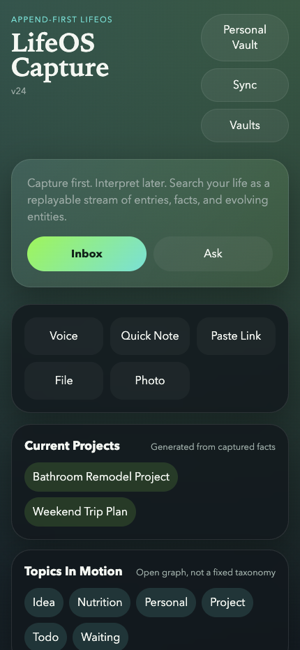
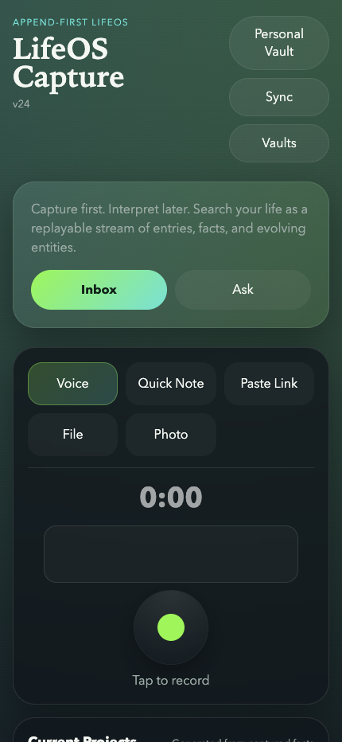
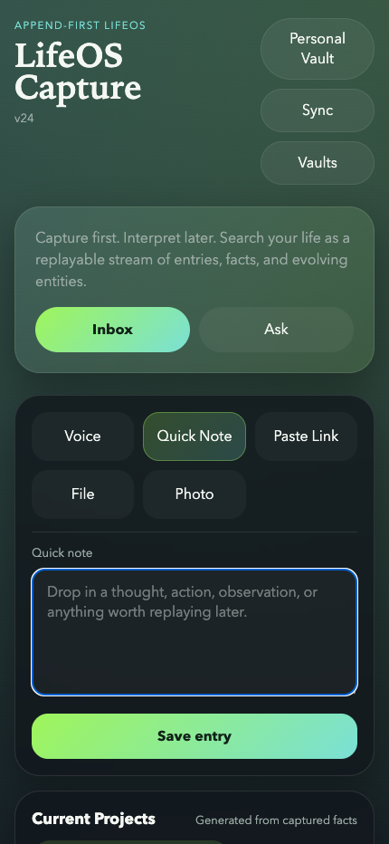
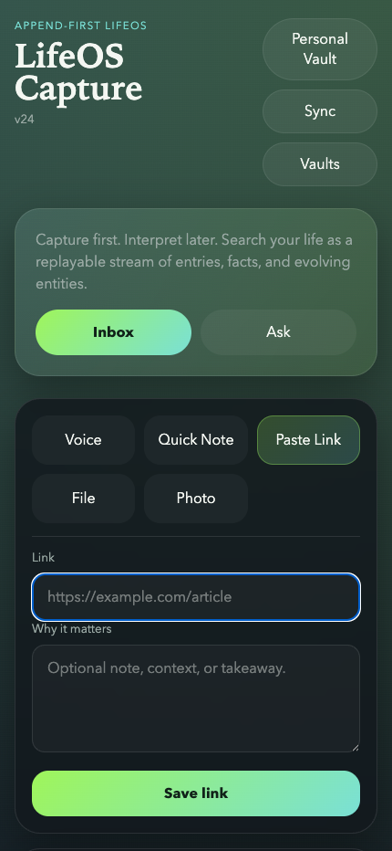
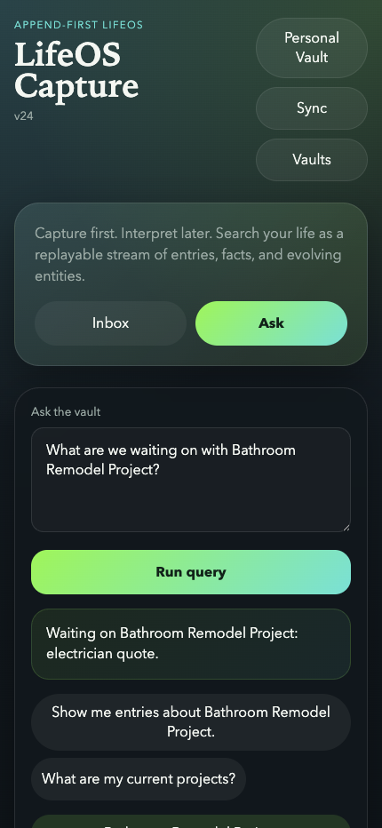
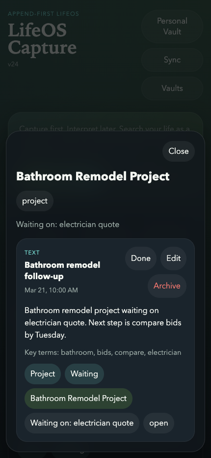
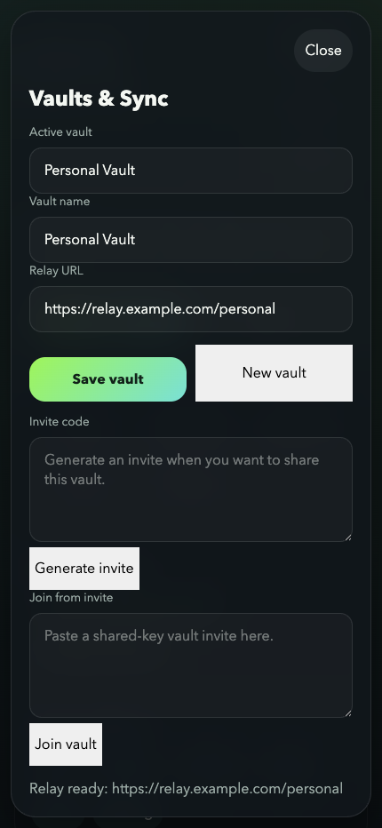
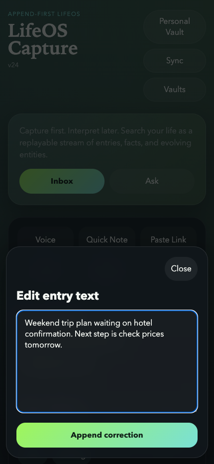

# LifeOS Capture Tour

This tour was captured from the main app shell at a mobile viewport with a representative demo vault so the UI shows realistic inbox, query, and overlay states.

## Sitemap

- `/`: App shell
- `/` -> `Inbox`: default landing view
- `/` -> `Inbox` -> `Voice`: voice capture mode
- `/` -> `Inbox` -> `Quick Note`: text capture mode
- `/` -> `Inbox` -> `Paste Link`: link capture mode
- `/` -> `Ask`: vault query view
- `/` -> `Entity Drawer`: project/topic detail overlay
- `/` -> `Vaults & Sync`: vault settings overlay
- `/` -> `Edit Entry`: entry editing overlay

Notes:

- `File` and `Photo` launch native pickers from the Inbox action grid, so they do not have standalone in-app screens to capture.
- Standalone prototype/reference pages under `public/` are intentionally excluded from this tour: `/design-variations/showboat.html`, `/design-variations/aurora.html`, `/design-variations/frost.html`, `/design-variations/neon.html`, and `/reference-capture-transcribe.html`.

## Mobile Tour

### Inbox

### Voice Capture

### Quick Note

### Paste Link

### Ask

### Entity Drawer

### Vaults & Sync

### Edit Entry

