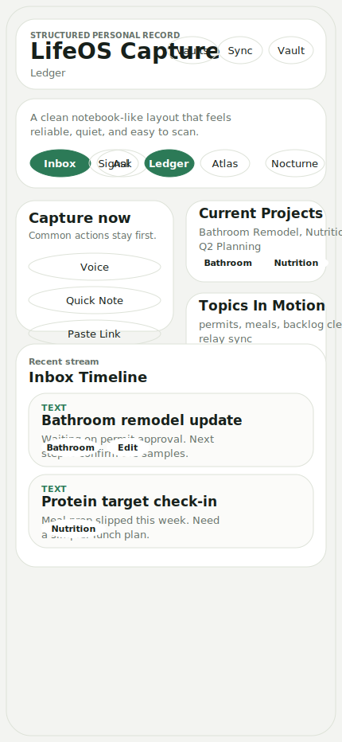
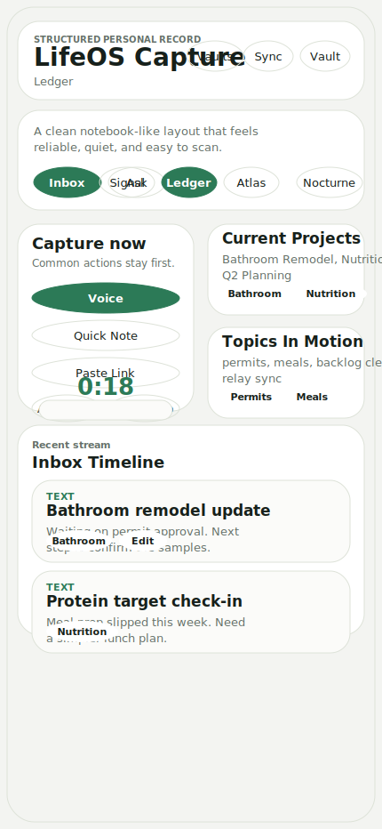
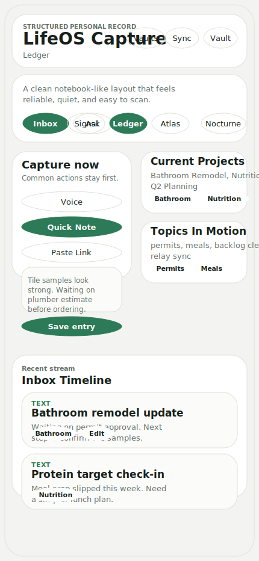
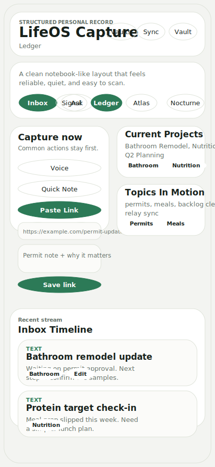
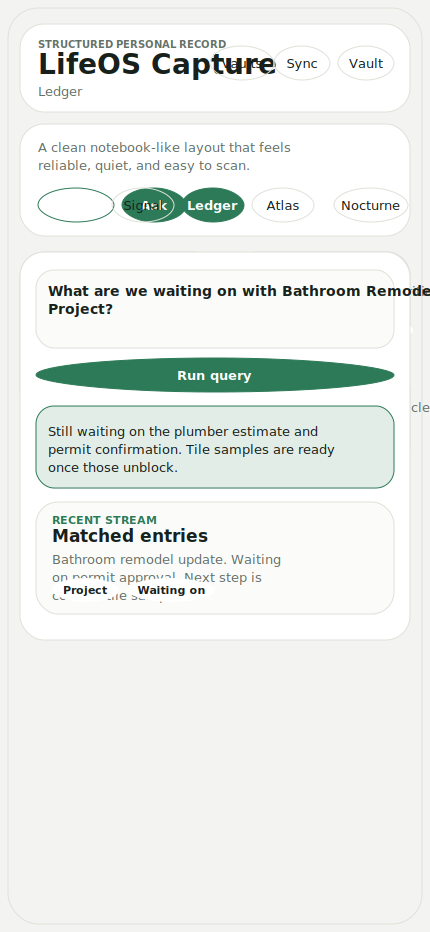
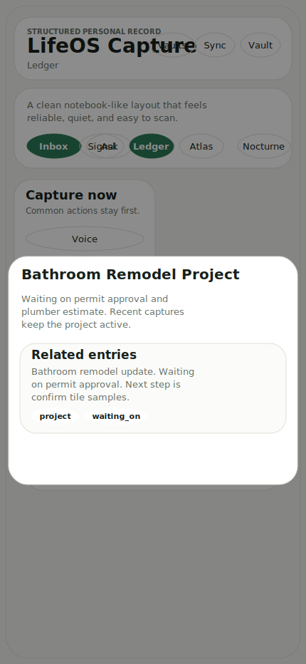
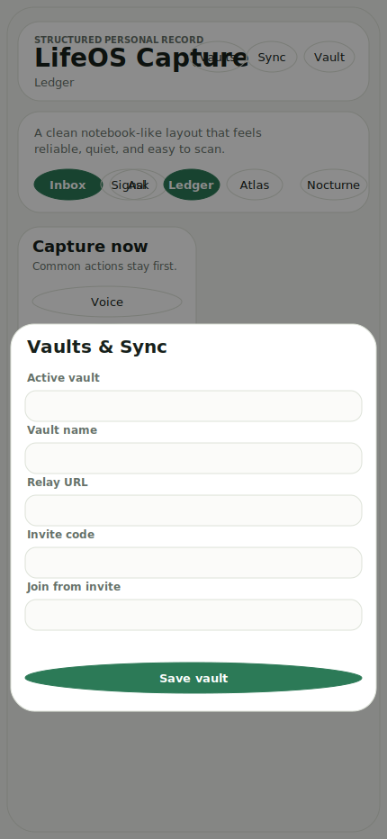
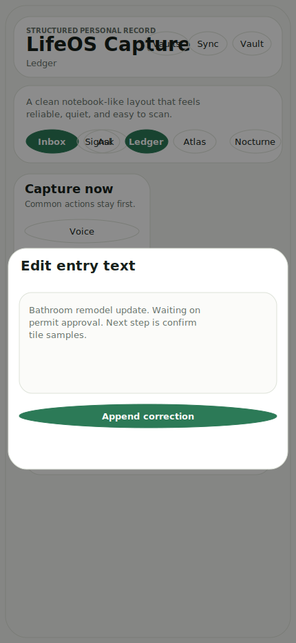

# Ledger Variant Tour

This tour captures the **Ledger** variant at a mobile viewport using the seeded demo vault.

Tour artifacts were generated with the built-in SVG fallback renderer via `scripts/capture-tour.sh ledger`.

## Screens

### Inbox

### Voice Capture

### Quick Note

### Paste Link

### Ask

### Entity Drawer

### Vaults & Sync

### Edit Entry

