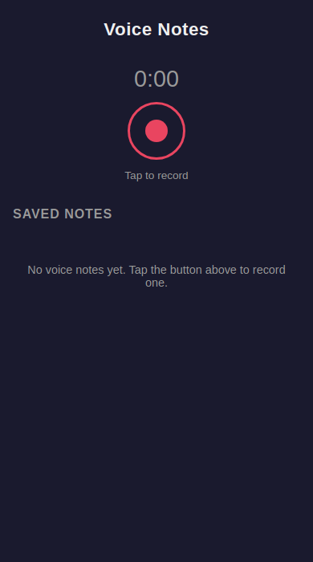
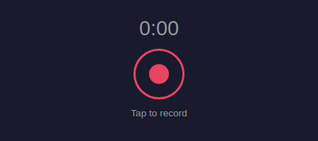
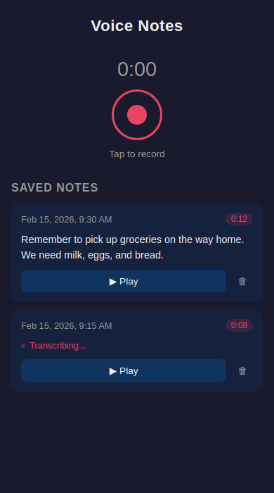
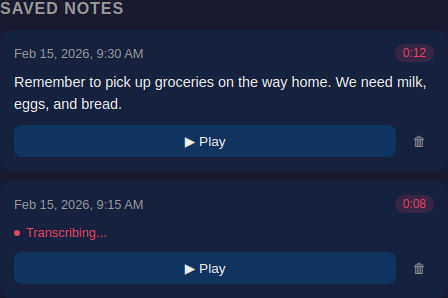

# Voice Notes App Tour

*2026-02-15T03:18:46Z by Showboat 0.5.0*

Voice Notes is a fully client-side voice note recorder with automatic transcription. No build step, no backend — just three files served over localhost. It records audio via the MediaRecorder API, stores notes in IndexedDB, and transcribes them locally using a Whisper model running in the browser through Hugging Face transformers.js.

## Project Structure

The entire app is three files — an HTML shell, a CSS stylesheet, and a JavaScript module:

```bash
ls -lh *.html *.css *.js
```

```output
-rw-r--r-- 1 root root 4.7K Feb 15 03:14 app.css
-rw-r--r-- 1 root root  17K Feb 15 03:15 app.js
-rw-r--r-- 1 root root 1.1K Feb 15 03:14 index.html
```

## Home Screen

The app opens to a minimal recording interface with a prominent record button, a timer, and a list of saved notes below. On first launch the notes list shows an empty-state prompt.

```bash {image}
screenshot-home.png
```



## Recording Interface

The recorder section uses a canvas element for waveform visualization, a timer display, and a circular record button. Tapping the button toggles between recording and stopped states — the icon morphs from a circle to a square.

```bash {image}
screenshot-recorder.png
```



## MIME Type Selection and Mic Caching

The app picks the best available audio codec at recording time and caches the microphone stream so subsequent recordings start instantly without re-prompting the user:

```bash
sed -n "/Determine supported MIME/,/mediaRecorder = new/p" app.js
```

```output
  // Determine supported MIME type
  const mimeType = MediaRecorder.isTypeSupported("audio/webm;codecs=opus")
    ? "audio/webm;codecs=opus"
    : MediaRecorder.isTypeSupported("audio/webm")
      ? "audio/webm"
      : "";

  const options = mimeType ? { mimeType } : {};
  mediaRecorder = new MediaRecorder(stream, options);
```

```bash
sed -n "/async function acquireMicStream/,/^}/p" app.js
```

```output
async function acquireMicStream() {
  // Reuse an existing live stream if tracks are still active
  if (cachedStream && cachedStream.getTracks().some((t) => t.readyState === "live")) {
    return cachedStream;
  }
  cachedStream = await navigator.mediaDevices.getUserMedia({ audio: true });
  return cachedStream;
}
```

## Crash-Safe Stop and Playback

When recording stops, the app snapshots all mutable state (recorder, chunks, timestamps) into local variables before clearing the module-level references. This means a rapid stop-then-start cycle cannot corrupt an in-flight `onstop` callback:

```bash
sed -n "/Capture references so the onstop/,/animationFrameId = null;/p" app.js
```

```output
    // Capture references so the onstop callback cleans up the correct session
    // even if a new recording starts before this one's onstop fires.
    const recorder = mediaRecorder;
    const chunks = audioChunks;
    const startTime = recordingStartTime;
    const ctx = audioContext;
    const frameId = animationFrameId;

    // Detach from module-level state immediately so a new recording
    // won't collide with this session's cleanup.
    mediaRecorder = null;
    audioChunks = [];
    audioContext = null;
    analyser = null;
    animationFrameId = null;
```

## IndexedDB Storage

Notes are stored in IndexedDB with full audio blobs — no server round-trips. The storage layer is a thin async wrapper over the native API:

```bash
sed -n "/const DB_NAME/,/^}$/p" app.js | head -20
```

```output
const DB_NAME = "voiceNotesDB";
const DB_VERSION = 1;
const STORE_NAME = "notes";

function openDB() {
  return new Promise((resolve, reject) => {
    const req = indexedDB.open(DB_NAME, DB_VERSION);
    req.onupgradeneeded = () => {
      const db = req.result;
      if (!db.objectStoreNames.contains(STORE_NAME)) {
        db.createObjectStore(STORE_NAME, { keyPath: "id" });
      }
    };
    req.onsuccess = () => resolve(req.result);
    req.onerror = () => reject(req.error);
  });
}
```

Each note is an object with `id`, `audioBlob`, `transcript`, `duration`, and `createdAt` fields. The `saveNote`, `getAllNotes`, `deleteNote`, and `updateNoteTranscript` functions each open a transaction, perform the operation, and resolve on `tx.oncomplete`.

## Whisper Transcription

The app loads a Whisper tiny English model via Hugging Face transformers.js — entirely in-browser, no API keys needed. The import and model loading:

```bash
sed -n "1p" app.js
```

```output
import { pipeline } from "https://cdn.jsdelivr.net/npm/@huggingface/transformers@3";
```

The model is loaded lazily on first use and cached for subsequent transcriptions. A progress callback shows download percentage in the UI. Transcription jobs are serialized through a promise queue so only one runs at a time.

### Audio Resampling

Before passing audio to Whisper, the app resamples it to 16 kHz mono using an OfflineAudioContext:

```bash
sed -n "/async function blobToFloat32Audio/,/^}/p" app.js
```

```output
async function blobToFloat32Audio(blob) {
  const arrayBuffer = await blob.arrayBuffer();
  const audioCtx = new (window.AudioContext || window.webkitAudioContext)();
  const decoded = await audioCtx.decodeAudioData(arrayBuffer);
  await audioCtx.close();

  const targetRate = 16000;
  const numSamples = Math.round(decoded.duration * targetRate);
  if (numSamples === 0) return new Float32Array(0);

  const offlineCtx = new OfflineAudioContext(1, numSamples, targetRate);
  const source = offlineCtx.createBufferSource();
  source.buffer = decoded;
  source.connect(offlineCtx.destination);
  source.start(0);

  const resampled = await offlineCtx.startRendering();
  return resampled.getChannelData(0);
}
```

## Saved Notes UI

Each note renders as a card with the recording date, duration badge, transcript text, a play/pause button with progress bar, and a delete button. Notes that are still being transcribed show a pulsing "Transcribing..." indicator.

```bash {image}
screenshot-notes.png
```



```bash {image}
screenshot-saved-notes.png
```



## How to Run

Serve the project directory with any static file server. The app requires HTTPS or localhost for microphone access:

```bash
echo "python3 -m http.server 8090"
```

```output
python3 -m http.server 8090
```

Then open http://localhost:8090 in your browser. The Whisper model downloads automatically on first use (~40 MB). After that, everything runs offline.
